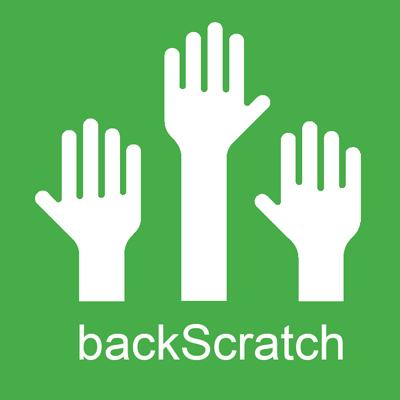
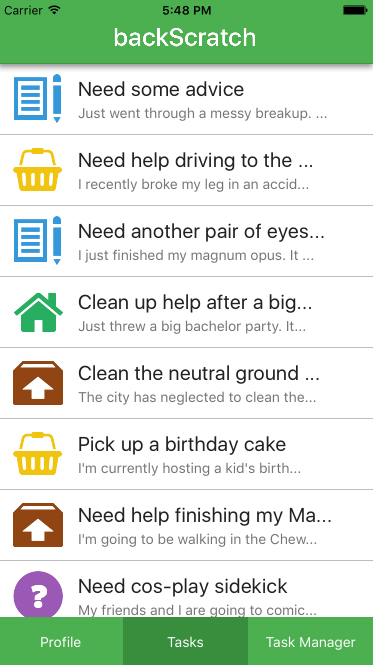
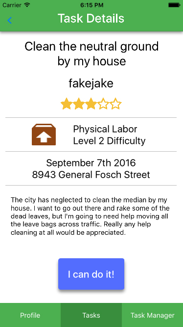
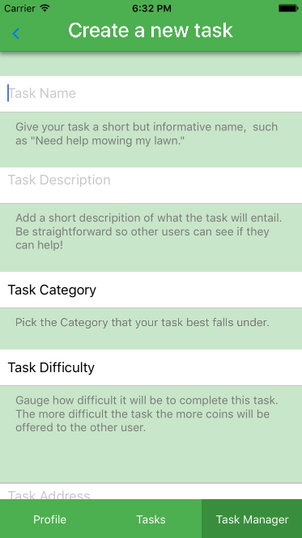
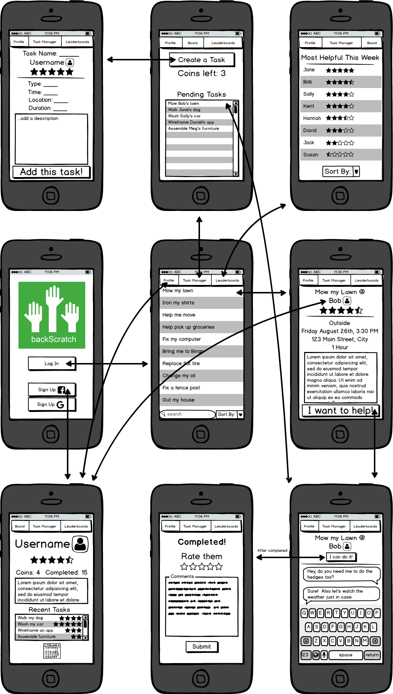
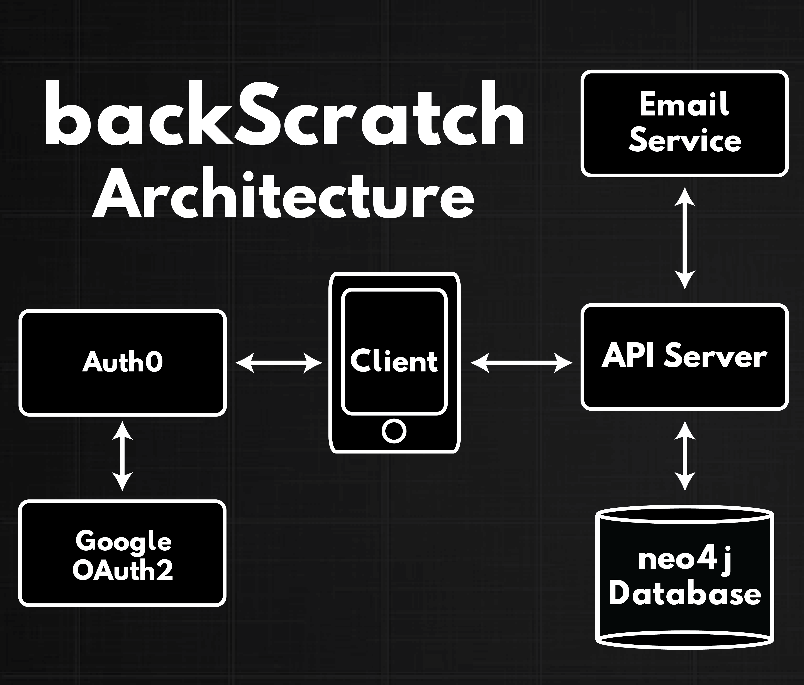
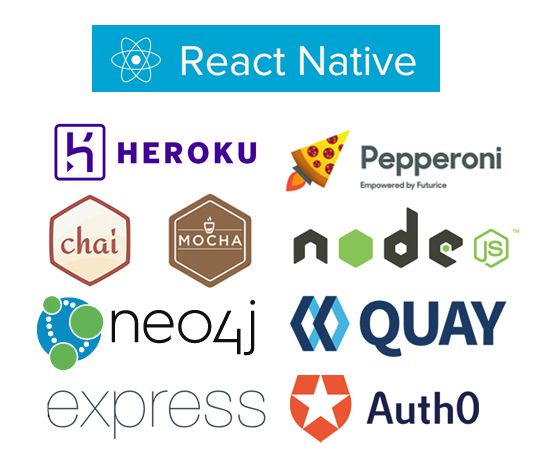
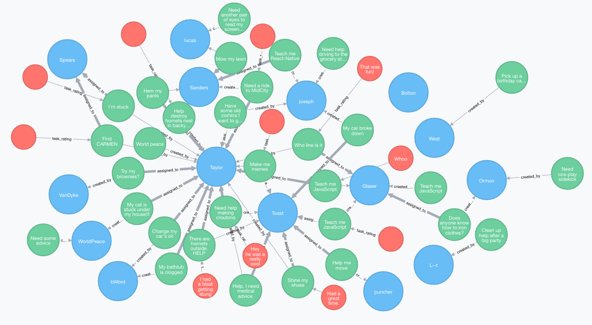

<div align="center">
  
</div>

<br>

<div align="center">
  <b style="width: 400px;>
    A mobile app that provides a social networking platform for users to trade skills and services within their community.
  </b>
</div>

<br>

<div align="center">
  <p>
    Have you ever needed an odd job done around your house, or maybe needed someone with a pickup truck to help you move?  Do you have a unique skill that could be extremely valuable in the right situation, like installing a ceiling fan?  backScratch can help solve these problems by allowing you to easily connect with other people that want to trade their own skills for tasks that they personally need to get done.
  </p>
</div>

## Team

  - __Product Owner__: [Kendall Spears](https://www.linkedin.com/in/kendall-spears-0853073a)
  - __Scrum Master__: [Harvey Sanders](https://www.linkedin.com/in/harvey-sanders-82828a42)
  - __Creative Director__: [Daniel Glaser](https://www.linkedin.com/in/danielmglaser)
  - __Lead Architect__: [Neal Taylor](https://www.linkedin.com/in/1nealtaylor)
  - __Development Team Members__: Daniel Glaser, Harvey Sanders, Kendall Spears, Neal Taylor

## How it Works

>Hold on, so how is this different from craigslist? 

backScratch operates off of a one to one trading algorithim.  The only way to request for someone to complete a task for you is to complete a task for someone else.  This "back scratching" method allows the app to reward helpful users while lowering unhelpful or unrealistic users.  After a user completes a task for someone else, both the task recipient and task doer rate the exchange.  When a user successfully completes a task for someone else he is awarded a number of coins based on how difficult the finished task was.  These coins can then be used to request tasks to be done for you.  This has the interesting side effect of converting unquantifiable services in the real world into a shared digital currency.  Alternatively, a selfless user could never ask to have anything done for them and essentially use the app as a hub for potential volunteer work.  A leaderboard will display the most helpful users, and encourage users to complete more tasks for others.

<br>

<div align="center">
  
  
  
</div>

<br>

## App Wireframe

<div align="center">
  
</div>

## App Architecture

<div align="center">
  
</div>

## Technology Stack

<div align="center">
  
</div>

## neo4j Database in Action

<div align="center">
  
</div>

## Development

### Requirements

- Node 5.1.1
- React-Native 0.29.2
- XCode 7.3.1
- neo4j 3.0.4
- CoCoPods 1.0.1

### Installing Dependencies

From within the root directory:

```
npm install
```

### Starting the iOS Simulator

From within the root directory of backScratch-client-p:

```
react-native run-ios
```

```
npm run start
```

### Roadmap

View the current github issues of our project [here](https://github.com/infinitetoast/backScratcher/issues)

## Contributing

See [CONTRIBUTING.md](CONTRIBUTING.md) for contribution guidelines.
